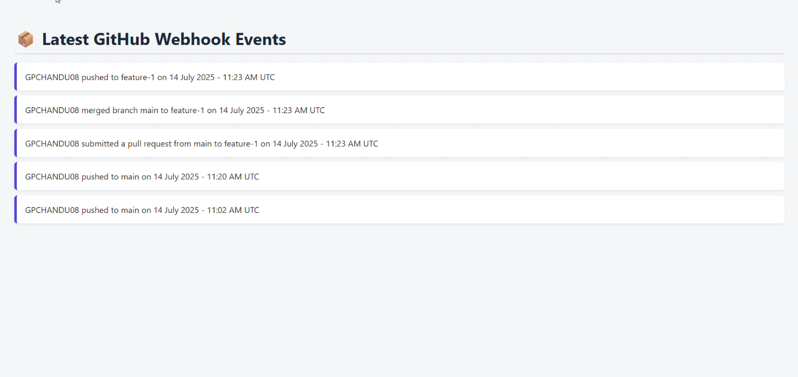
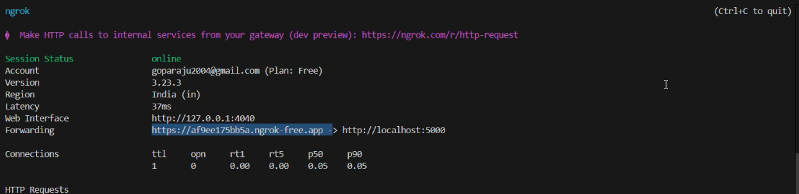

# 🛠️ Webhook Receiver with Flask & MongoDB

This repository contains a Python Flask application that receives GitHub webhook events (`push`, `pull_request`, and `merge`) and displays them in a live-updating UI.

---
## 🏷️ Badges


---
## 📦 Features

- 📥 Receives GitHub webhook events via `/webhook/receiver`
- 📦 Stores event details in MongoDB (Atlas or local)
- 🌐 Displays the latest 10 events on a live-updating UI (`/webhook/`)
- 🔁 Auto-refreshes every 15 seconds to fetch new events
- 🔒 Supports local testing with `Ngrok` for public webhook URL
- ✅ Built as part of Techstax Developer Assessment (Jul 2025)

---

## 🧠 Tech Stack

| Component    | Technology      |
| ------------ | --------------- |
| Backend      | Flask (Python)  |
| Database     | MongoDB (Local) |
| Tunneling    | Ngrok           |
| Webhooks     | GitHub Actions  |
| Data Format  | JSON REST APIs  |

---

## 📁 Project Structure

```
webhook-repo/
│
├── app/
│   ├── __init__.py
│   ├── extensions.py
│   ├── webhook/
│       └── routes.py
│
├── templates/
│   └── index.html
│
├── static/    (optional for CSS/JS)
│
├── requirements.txt
├── run.py
└── README.md
```

---

## ⚙️ Installation & Setup

### 1️⃣ Clone this repo

```bash
git clone https://github.com/GPCHANDU08/webhook-repo
cd webhook-repo
```

### 2️⃣ Create Virtual Environment

```bash
pip install virtualenv
virtualenv venv
```

### 3️⃣ Activate Environment

#### Windows (PowerShell):

```bash
.\venv\Scripts\activate
```

#### Git Bash:

```bash
source venv/Scripts/activate
```

### 4️⃣ Install Dependencies

```bash
pip install -r requirements.txt
```

### 5️⃣ Start MongoDB Server

If installed at:

```
C:\Program Files\MongoDB\Server\8.0\bin
```

Run:

```bash
"C:\Program Files\MongoDB\Server\8.0\bin\mongod.exe"
```

### 6️⃣ Run Flask Application

```bash
python run.py
```

This will start your server at:

```
http://127.0.0.1:5000
```

---

## 🌐 Expose Local Server (Ngrok)

```bash
ngrok http 5000
```

Copy the HTTPS forwarding URL and paste it into your:

```
GitHub → Repo → Settings → Webhooks → Payload URL
```

Endpoint:

```
<ngrok-url>/webhook/receiver
```

---

## 🔌 REST API Endpoints

### ▶ Webhook Receiver

```
POST /webhook/receiver
```

GitHub sends push / PR / merge payloads here.

### ▶ Fetch Latest Events

```
GET /webhook/events
```

Returns last 10 formatted events.

### ▶ Dashboard UI

```
GET /
```

---

## 📸 Screenshots

### 🖥️ 1️⃣ Real-Time Dashboard



---

### 🚚 2️⃣ GitHub Webhook Delivery


---

### 🌐 3️⃣ Ngrok Tunnel Running



---

### 💻 4️⃣ Flask Server Receiving Events


---

## 5️⃣🎞️ Output demo

Real-time commit → webhook → dashboard update:


---

## 🎯 How It Works

1. GitHub webhook triggers on push / PR / merge
2. webhook sends JSON payload
3. Flask receives event and extracts details
4. Event stored in MongoDB
5. Dashboard fetches latest data every 15 seconds
6. UI updates automatically without manual refresh

---

## 🧑‍💻 Author

**Poorna Chand Goparaju**
Feel free to connect on LinkedIn!

[](https://www.linkedin.com/in/goparaju-poornachand/)

---


## ⭐ Want to Support?

If you like this project:

```
⭐ Star this repo
```
